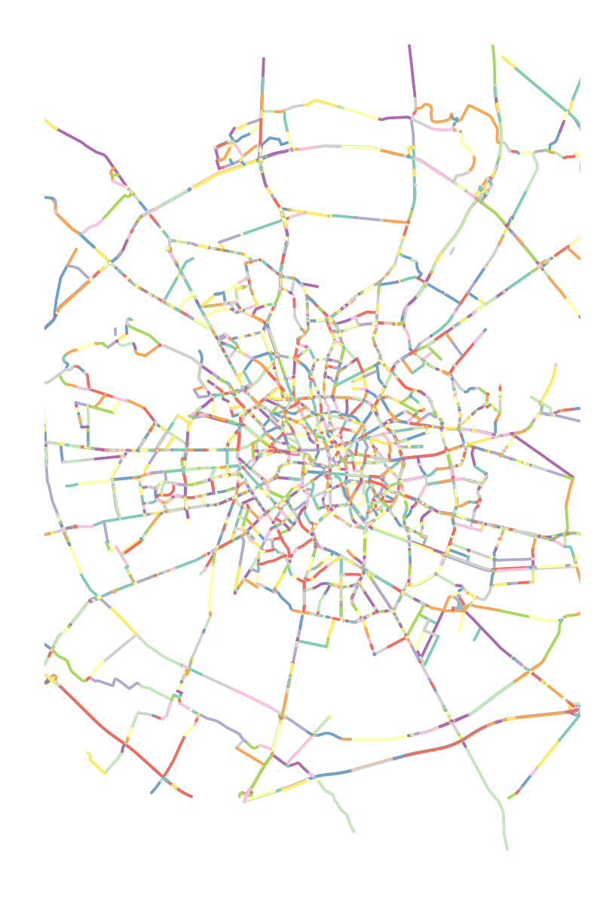
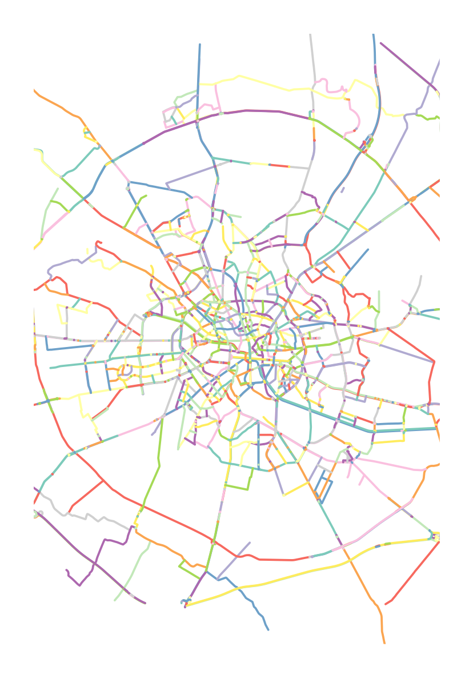

# rcoins

<!-- badges: start -->
[](https://github.com/CityRiverSpaces/rcoins/actions/workflows/R-CMD-check.yaml)
<!-- badges: end -->

Identify continuous lines in a network using an approach based on the Continuity in Steet Network (COINS) method[^1].

[^1]: [Tripathy, P., Rao, P., Balakrishnan, K., & Malladi, T. (2021). An open-source tool to extract natural continuity and hierarchy of urban street networks. Environment and Planning B: Urban Analytics and City Science, 48(8), 2188-2205.][coins]

[coins]: http://dx.doi.org/10.1177/2399808320967680

## Installation

You can install the development version of rcoins from the R terminal like so:

``` r
# install.packages("devtools")
devtools::install_github("CityRiverSpaces/rcoins")
```

### Alternative installation using `conda`

An environment including rcoins and all its dependencies can be created using Conda (or its faster implementation Mamba).

Conda can be installed using the Miniforge scripts provided [here](https://conda-forge.org/miniforge/) (download one of the Mambaforge scripts in order to install Mamba as well).

First clone this repository and access it:

``` shell
git clone https://github.com/CityRiverSpaces/rcoins.git
cd rcoins/
```

Run `conda` (or `mamba`, if using Mambaforge) to create an environment with all the required dependencies:

``` shell
conda env create -f environment.yml
conda activate rcoins
```

Install the development version of rcoins:

``` shell
Rscript -e 'devtools::install()'
```

## Example

Given the street network of the city of Bucharest (data source: [OpenStreetMap][osm])

``` r
library(rcoins)
streets <- bucharest$streets
```

<details>

<summary> Plot streets </summary>

``` r
plot(sf::st_geometry(streets),
     col = sf::sf.colors(n = nrow(streets), categorical = TRUE),
     lwd = 5, xlim = c(418500, 437500), ylim = c(4909800, 4931500))
```

</details>



Determine continuous lines in the network as:

``` r
continuous_streets <- stroke(streets)
```

<details>

<summary> Plot continuous streets </summary>

``` r
plot(continuous_streets,
     col = sf::sf.colors(n = length(continuous_streets), categorical = TRUE),
     lwd = 5, xlim = c(418500, 437500), ylim = c(4909800, 4931500))
```

</details>



[osm]: https://www.openstreetmap.org/

## Development

When modifying the R source code, load the library as:

``` r
devtools::load_all()
```

Run tests locally:

``` r
devtools::test()
```

Run the linter locally:

``` r
lintr::lint_package()
```
